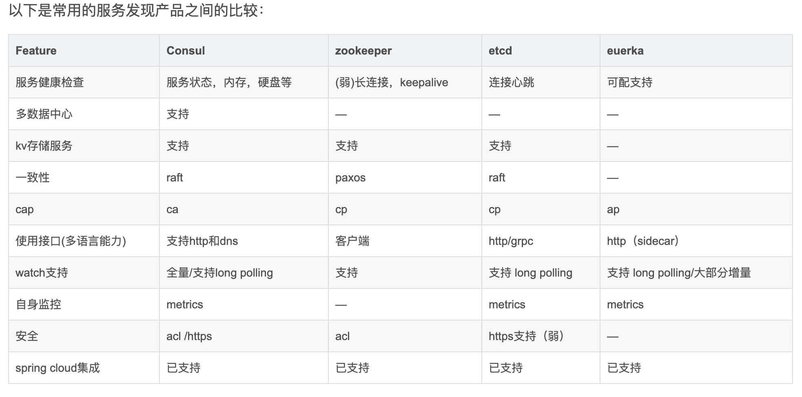

## 注册中心对比

1:zookeeper 节点中任意数据变化不会立刻同步到其他节点 get前调用下sync  
2:watch 不会把sever节点每次的变更都同步到client。因此需要加上版本对比本地，用高版本替换低版本。或者重新get一次  
3:zk临时节点在链接断开后 超过设置的过期时间后 才会删除。做服务发现 下线。

写有2种方式  write master （写主，MySQL这种 读写分离）  write any 任意节点写 节点间数据同步。
zk是write any方式